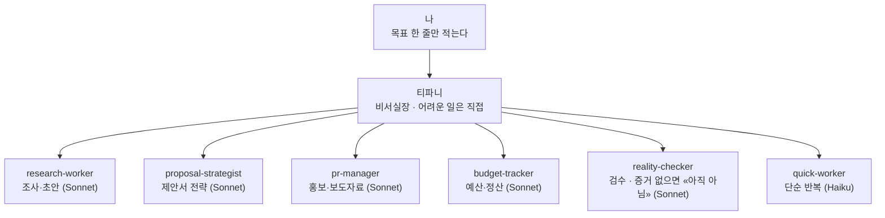

# AI 업무 팀 (리드 티파니 + 직원 여섯)

Claude Code에서 "비서실장 한 명 + 직원 여러 명" 구조로 일하기 위한 설정이다.
나는 티파니에게 목표 한 줄만 말한다. 티파니가 일을 나누고, 직원에게 시키고, 검수하고, 보고한다.

## 한 장으로 보면

화살표 방향이 핵심이다. 내가 직원 여섯을 하나씩 부르지 않는다. 티파니에게만 말한다.

## 직원 목록

| 직원 | 하는 일 | 모델 | 파일 |
|---|---|---|---|
| research-worker | 발주처 조사, 유사 사례, 출처 있는 리서치, 섹션 초안 | Sonnet | `.claude/agents/research-worker.md` |
| proposal-strategist | 승리 테마, 3막 구조, 평가위원용 요약문, RFP 요구사항 준수표 | Sonnet | `.claude/agents/proposal-strategist.md` |
| pr-manager | 보도자료, 언론 피칭, 핵심 메시지 3개, 위기 초기 입장문 | Sonnet | `.claude/agents/pr-manager.md` |
| budget-tracker | 예산안, 예산 대 집행, 정산 보고서, 견적 비교 | Sonnet | `.claude/agents/budget-tracker.md` |
| reality-checker | 요구사항 대 실제, 숫자 대조, 출처 확인. 기본 판정 "아직 아님" | Sonnet | `.claude/agents/reality-checker.md` |
| quick-worker | 목록 정리, 표 변환, 파일 찾기, 짧은 요약, 형식 통일 | Haiku | `.claude/agents/quick-worker.md` |

티파니(리드)의 규칙은 `CLAUDE.md`에 있다. 위임, 검수, 보완 지시, 보고 형식, 비용 가드.

## 사용법

이 저장소를 연 Claude Code 세션에서 목표를 한 줄로 말한다. 직원 이름을 넣으면 그 직원이 불린다.

**예시 1 · 제안서**
> 어울림축제 과업지시서로 제안서 뼈대 잡아줘. 발주처 조사는 research-worker, 승리 테마와 요약문은 proposal-strategist, 마지막에 reality-checker 검수까지.

**예시 2 · 정산**
> 이번 행사 정산서 만들어줘. budget-tracker가 예산 대 집행 표 만들고, reality-checker가 합계와 증빙 확인해.

**예시 3 · 홍보**
> 행사 보도자료랑 지역지 피칭 메일 써줘. pr-manager가 초안, 핵심 메시지 3개 먼저 정하고.

**요령**
- 목표는 한 줄, 결과물은 하나. 두 개를 시키면 티파니도 헷갈린다.
- 검수관이 "아직 아님"이라고 하면 실패가 아니다. 증거를 채우라는 뜻이다.
- 직원이 부족해지면 그때 한 명씩 더 만든다. 처음부터 다 만들지 않는다.

## 직원 추가하기

`.claude/agents/이름.md` 파일을 만들면 된다. 맨 위 frontmatter에서 `model`(haiku/sonnet/opus), `tools`, `maxTurns`를 정하고, 본문에 성격과 일하는 순서를 적는다. 새 세션을 열면 자동으로 읽힌다.

## 비용

직원 하나가 독립된 Claude 호출이라 직원 수만큼 사용량이 늘어난다. 단순 작업은 Haiku로 두는 것이 비용의 핵심이다. `CLAUDE.md`의 비용 가드 규칙에 따라 큰 작업은 시작 전에 컨펌을 받는다.

## 출처

- 직원 4명(proposal-strategist, reality-checker, pr-manager, budget-tracker)의 원형은 [agency-agents](https://github.com/msitarzewski/agency-agents) 저장소(MIT)의 Proposal Strategist, Reality Checker, PR & Communications Manager, Finance Tracker다. 한국 공공입찰·행사 업무에 맞게 한국어로 고쳐 썼다.
- Claude Code 서브에이전트: https://code.claude.com/docs/en/sub-agents
- 에이전트 팀(직원끼리 직접 대화가 필요할 때, 실험 기능): https://code.claude.com/docs/en/agent-teams
